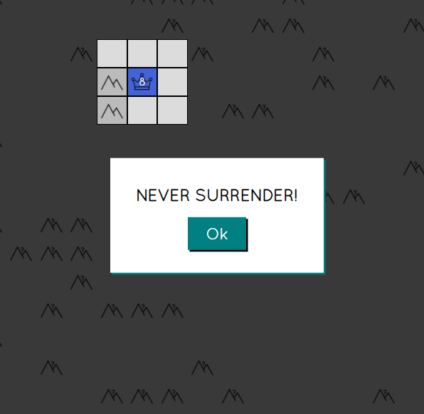
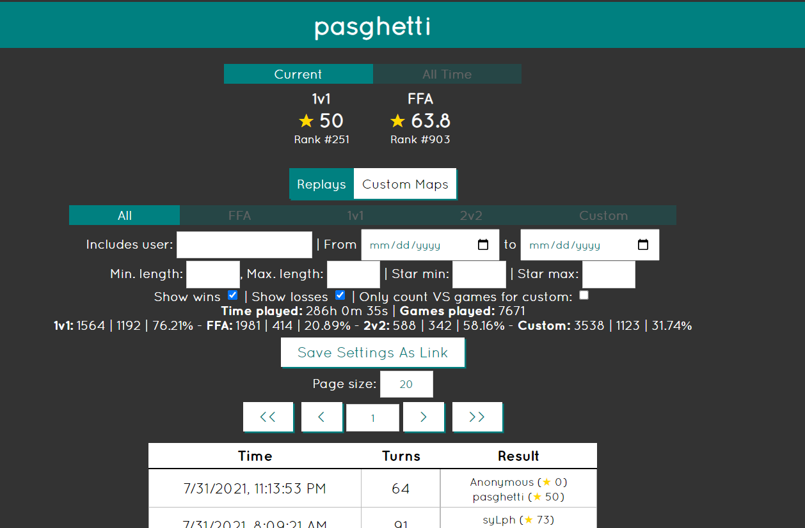
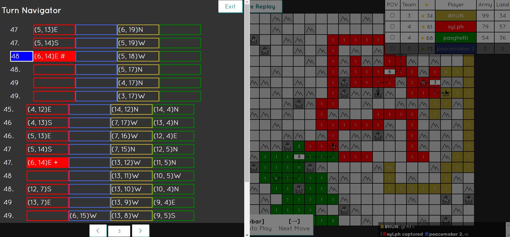
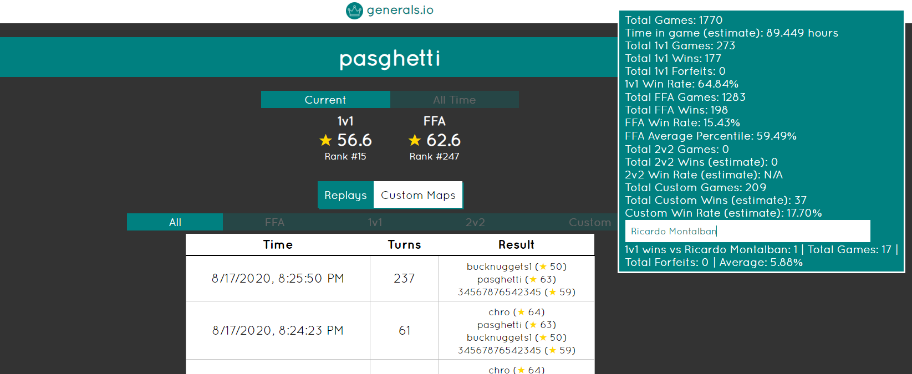

# Extensions

Extensions are user-made scripts which provide small quality-of-life adjustments to generals.io. All of the listed extensions on this page are allowed and approved by the game developers.

## Installation

In order to use the extensions below:

1. Install a browser extension called Tampermonkey (see [https://www.tampermonkey.net/](https://www.tampermonkey.net/)).
2. Click on the link to the extension you want to install.

**If the extension has an asterisk next to its name:**

3. Highlight the whole script (all of the code on the screen) and copy it.
4. Go to the Tampermonkey dashboard and click the plus sign.
5. Paste in the script and press Ctrl+s to save it.

**Otherwise:**

3. Click the "Raw" button on the page you are sent to, which is next to the name of the extension (usually ending in .user.js).
4. Click "Install" when Tampermonkey prompts you to install the extension.

Now if you reload, you should be able to see the effects of the script!

## List of Extensions

If you want to preview some of the extensions before you get them, sample screenshots of some extensions are available below. Join our Discord server ([https://discord.com/invite/QP63V5Y](https://discord.com/invite/QP63V5Y)) if you have questions.

| Name and Link | Author | Description | Notes |
| :- | :-: | :-: | :-: |
| [Auto Spectate Extension](https://gist.github.com/pasghetti/f8d37629c450a9ff6a635f7728798dc6) | pasghetti | Rejoins custom room automatically if user was spectating a game that ended. | You can turn off the automatic rejoining with a button on the custom room screen. |
| [Map Tools Extension](https://gist.github.com/Allen-B1/1f07555ee365696cfe57547ea46fe6e3) | person2597 | Shows list of all versions of custom maps created on custom map page, labeled with semantic versioning. Fixes "Download Map" button. | |
| [Profile Fix Extension]([https://gist.github.com/pasghetti/fde47a68b0a8be8adbe52708fb6be6e0](https://gist.github.com/EklipZgit/54b95bc407c414602c11e7000cfa7c01)) | pasghetti | Shows statistics on a player's profile page. Allows filtering and search of replays by length, star ranges, date ranges, opponent, etc. | |
| \*[Queue Sniper Extension](https://github.com/zzd233/Generals.io-1v1-match-helper/blob/87bada575eb088a6a13d26516637007c6df83b91/Generals.io-1v1-match-helper.js) | zzd223 | (NOTE: older versions are incompatible with generals.io. Be sure to keep this up to date) Tracks last time opponents played in 1v1 queue, either from a friend list or above a certain rank. Can "auto match" tracked players, allowing you to match with players you want to play against in the 1v1 queue. | Auto match works by automatically joining 1v1 queue when one of the tracked players has just finished a game. |
| [Recolor Extension](https://gist.github.com/Allen-B1/49cebdaddc14e2e45a2282cf5cdc88b3) | person2597 | Makes members of the same team appear to be different shades of the same color, making it easier to see which people are teamed in custom team games and 2v2s. | |
| [Replay Enhancement Extension](https://gist.github.com/pasghetti/895d9c5e90e07250992edddab3ace3d0) | pasghetti | Allows user to edit replays to show alternate situations. Allows user to mark up replay maps with arrows. Improves replay controls. | Right clicking and dragging allows user to draw arrows on map, also measuring distance between tiles.  Backspace removes last arrow drawn. Replays can be edited by clicking tiles like you would in-game and moving with WASD. Turn navigator menu allows you to see edits made to your replay. Pressing Tab returns the last "alternate" move made. Pressing Ctrl and the right/left arrow key allows user to go forward/backward in steps of 25 turns. Replay can be played in reverse. |
| [Tournament Extension](https://gist.github.com/Allen-B1/b5b9440306848d4349b287103cc18b98) | person2597 | Creates private generals.io tournaments with BracketHQ. | |
| [Replay Move Outliner](https://github.com/danieljpetersen/generals-io-replay-move-outliner) | sub | Highlights player moves each tick in replays. | |

Obsolete:

| Name and Link | Author | Description | Notes | Obsoleted By |
| :- | :-: | :-: | :-: | :-: |
| [Better Stat Extension](https://gist.github.com/Allen-B1/e94d7b3ce1ee9b9a73b60e95d983ffc6) | person2597 | Shows statistics (win rate, games played, etc.) on profile for a player with input of date ranges and opponents. | | Profile Fix Extension |
| \*[Friendlist Extension](https://gist.github.com/Element00/39ef62014e75d03d1bd6c31a4f554111) | President Trump | Keeps track of a list of friends, ex. last game mode they played and time since last game played. | Friend list can only be edited by editing the code itself to add more friends. | Queue Sniper Extension |
| \*[Replay POV Extension](https://gist.github.com/pasghetti/d93c364b962e825b3345a36d57779e52) | pasghetti | Allows user to show fog of war and perspective of different users during game. | No longer maintained, likely broken. | Implemented in game, v27.2 | 
| \*[Stat Extension](https://gist.github.com/pasghetti/c05e35c959137b55721863d27424dbd6) | pasghetti | Shows statistics (win rate, games played, etc.) on profile for a player. | | Better Stat Extension, Profile Fix Extension |
| \*[Team Extension](https://gist.github.com/pasghetti/6e32298426b1fa0d4213ae70bfbbdb99) | pasghetti | Makes members of the same team appear the same color, with borders outlined in different colors. | | Recolor Extension |

Joke extensions:

| Name and Link | Author | Description | Notes |
| :- | :-: | :-: | :-: |
| [Courage Extension](https://gist.github.com/pasghetti/6a2d5ddbabddf3665dfd82a3a8254e15) | pasghetti | Displays motivational message instead of surrender prompt when surrender key is pressed. Prevents user from surrendering. | |
| [Superficiality Extension](https://gist.github.com/pasghetti/875223987490d5658579908acc3de36c) | pasghetti | Automatically sends a greeting ("glhf" by default) to opponents at beginning of game and a message at the end of the game ("gg" by default). Minimizes the chat window as soon as game starts. | Code can be edited to change greeting and end messages. |

## Extension Image Gallery
Courage Extension:

Profile Fix Extension:

Replay Enhancement Extension:

Stat Extension:

Team Extension:

